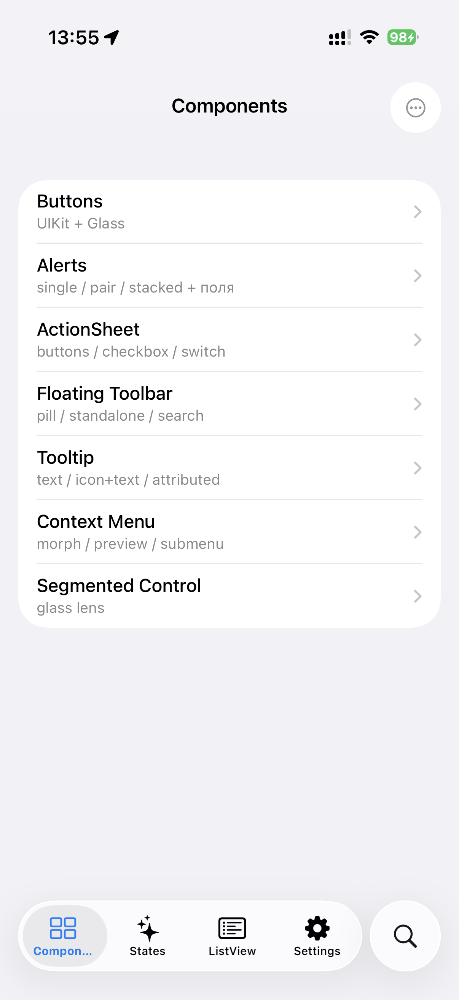
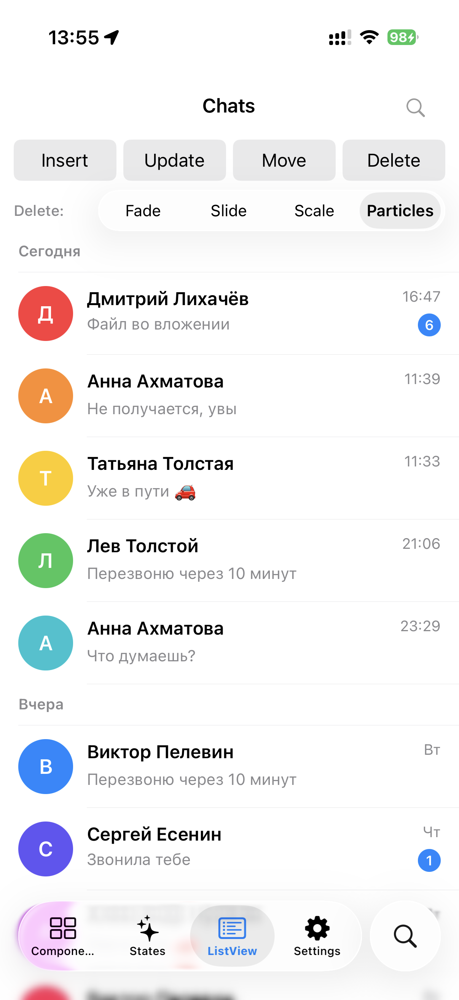
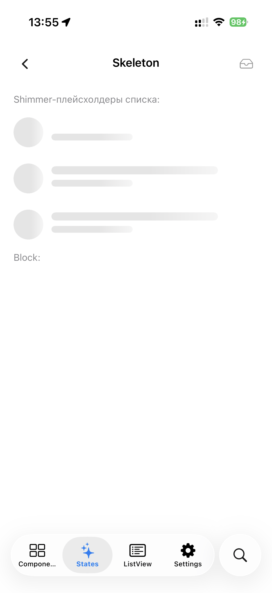
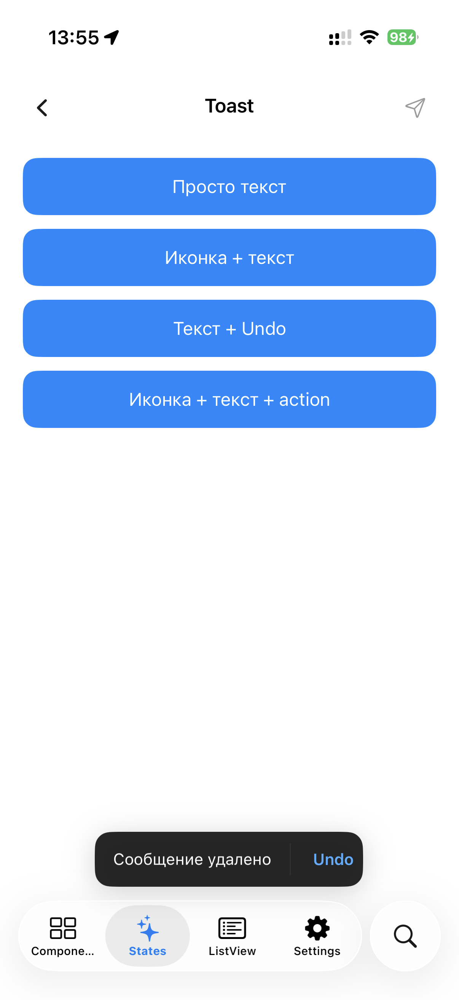
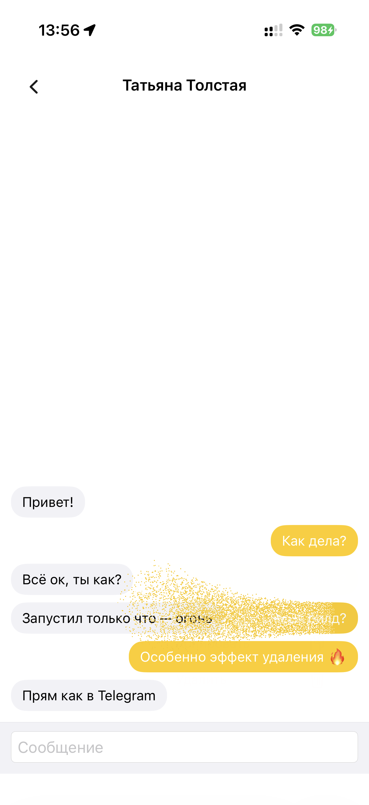
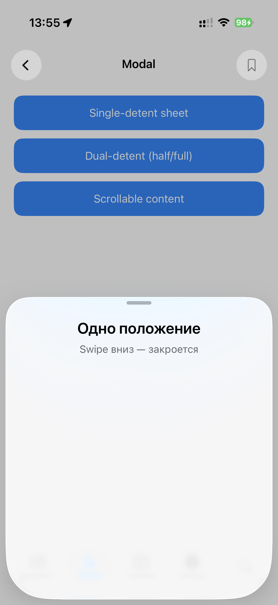

# AetherUI

[](https://www.apple.com/ios/)
[](https://swift.org/)
[](https://swift.org/package-manager/)
[](https://nsnull97.github.io/AetherUI/documentation/aetherui/)

Texture-first UIKit-hosted фреймворк навигации с тремя appearance styles:
классическим Legacy и поколениями Liquid Glass v1/v2. Новая линия AetherUI
требует iOS 15+ и переезжает на ASDK / Texture: UIKit остаётся системной
boundary-оболочкой, а renderable-компоненты становятся `ASDisplayNode`.
`TextNode`, `AetherListItemNode` и новый `AetherListNode` уже переведены на
Texture-backed rendering/list logic. Новые `AetherScreenNode`,
`AetherNavigationNode`, `AetherTabContainerNode`, `AetherScreenController`,
`AetherNodeNavigationController`, `AetherNodeTabContainerController`,
`AetherNodePageController`, `AetherToolbarNode`, `AetherNavigationBarNode`,
`AetherSliderNode`, `AetherContentUnavailableNode`, `AetherSkeletonNode` и
control-ноды задают node-first API без публичной привязки к UIKit-композиции.

📖 **[Документация](https://nsnull97.github.io/AetherUI/documentation/aetherui/)** — DocC, обновляется на каждом push автоматически.

---

## Скриншоты

<table>
  <tr>
    <td></td>
    <td></td>
    <td></td>
  </tr>
  <tr>
    <td align="center"><b>Components</b><br/><sub>Buttons, Alerts, ActionSheet, Toolbar, Tooltip, ContextMenu, SegmentedControl</sub></td>
    <td align="center"><b>ListView</b><br/><sub>Virtualized, transactions, particle dust dissolve</sub></td>
    <td align="center"><b>Skeleton</b><br/><sub>Shimmer placeholders для loading-states</sub></td>
  </tr>
  <tr>
    <td></td>
    <td></td>
    <td></td>
  </tr>
  <tr>
    <td align="center"><b>Toast</b><br/><sub>Text, icon+text, action, undo</sub></td>
    <td align="center"><b>Particle Dust Effect</b><br/><sub>Metal compute shaders для destructive remove</sub></td>
    <td align="center"><b>Modal Sheet</b><br/><sub>Single / dual detent с glass surface</sub></td>
  </tr>
</table>

---

## Что внутри

| Категория | Компоненты |
|---|---|
| **Навигация** | `AetherNavigationNode`, `AetherNavigationBarNode`, `AetherNodeNavigationController` (node-first), `AetherWindow`, legacy `AetherNavigationController` |
| **Tab/page** | `AetherTabContainerNode`, `AetherNodeTabContainerController`, `AetherPageContainerNode`, `AetherNodePageController`, legacy `AetherTabBarController` |
| **Glass** | `AetherGlassButtonNode`, `GlassBackgroundView`, `GlassControlGroup`, `GlassButton`, `LiquidLensView`, `EdgeEffectView` |
| **Sheets** | `AetherModalNodeNavigationController`, node content overloads for `AetherModalController`, `AetherActionSheetController`, `AetherAlertController` |
| **Overlays** | `AetherToastController`, `AetherTooltipController`, `ContextMenuController` |
| **Lists** | `AetherListNode` (Texture-native ASScrollNode engine), deprecated legacy `AetherListView` |
| **Bars** | `AetherToolbarNode`, legacy `AetherFloatingToolbarView`, legacy `AetherToolbarView` |
| **Misc** | `AetherSegmentedControlNode`, `AetherSliderNode`, `AetherSkeletonNode`, `AetherContentUnavailableNode` |
| **Search** | `AetherSearchController` (nav bar / bottom placement), `AetherActiveSearchBar` |

### Appearance styles

| Стиль | Назначение |
|---|---|
| **Legacy** | Классический non-Liquid-Glass renderer: публичный `UIBlurEffect(.systemChromeMaterial)`, обычные separator/border/shadow и стандартные control states. |
| **Liquid Glass v1** | Первое поколение Liquid Glass, ранее называвшееся iOS 26 style. |
| **Liquid Glass v2** | Второе поколение Liquid Glass, ранее называвшееся iOS 27 style. |

Legacy — явно выбираемая тема, а не «режим для старых iOS». Она доступна и
на актуальной системе и не создаёт `UIGlassEffect`/Liquid Glass renderer.

```swift
AetherApplication {
    AppearanceStyle(.legacy) // также .liquidGlassV1 или .liquidGlassV2
    WindowScene(id: "main") { _ in
        AetherNavigationController(rootViewController: HomeController())
    }
}
```

Стиль уже созданной иерархии можно сменить без пересоздания окна:

```swift
AetherApplicationRuntime.shared?.updateAppearanceStyle(.liquidGlassV2)
```

Миграция имён: `.iOS26` → `.liquidGlassV1`, `.iOS27` →
`.liquidGlassV2`. Старые spellings оставлены как deprecated aliases, а
сохранённые значения iOS 26/27 декодируются новым `Codable` API. Новые значения
сериализуются как `legacy`, `liquid-glass-v1` и `liquid-glass-v2`.

### Legacy hard gates в публичных transitions

Публичные transition-контейнеры принимают канонический appearance до создания
renderer'а:

```swift
let gooey = AetherGooeyContextMenuTransition(
    configuration: .default(appearance: .legacy)
)

let lens = LensTransitionContainer(
    effectView: sourceEffectView,
    appearanceStyle: .legacy
)

let sourceMorph = AetherSourceMorphController(
    contentView: contentView,
    targetSize: CGSize(width: 320, height: 280),
    appearanceStyle: .legacy
)

let attachments = AetherAttachmentMenuController(
    items: items,
    appearanceStyle: .legacy
)
```

Explicit `appearanceStyle` закрепляет локальный стиль. У
`LensTransitionContainer`, `AetherSourceMorphController` и
`AetherAttachmentMenuController` значение `nil` наследует live runtime. В
низкоуровневой `AetherGooeyContextMenuTransitionConfiguration` отсутствующий
style снимком фиксирует runtime в момент создания конфигурации; фабрика
`default(appearance:)` всегда фиксирует переданный style.

Legacy hard gate выполняется до Liquid-специфичных allocation. Поверхности
используют публичный `UIBlurEffect(.systemChromeMaterial)`; gooey и source
morph переходят на обычные UIKit alpha/scale animations без Metal, SDF,
source snapshot и собственного `CADisplayLink`. `LensTransitionContainer` не
создаёт private SDF/displacement implementation и сохраняет движение только
через публичные Core Animation size/position/corner-radius keyframes.

### Platform support for Liquid Glass

- **Native Liquid Glass** через системный `UIGlassEffect` на iOS 26+ (на iOS < 26 — compatibility fallback на `UIVisualEffectView` с тонированными слоями)
- **Liquid Glass v1 push/pop transitions**: device corner radius на 4-х углах movingView, без dim, parallax 30%, spring rubberband на flick'ах
- **Edge-effect frost** на границе chrome ↔ scroll-content (variable blur в private-сборке, masked `UIVisualEffectView` в App Store-safe сборке)

### APPSTORE_SAFE

Приватный runtime разделён на этапе компиляции одним условием:

| Конфигурация | `APPSTORE_SAFE` | Реализация |
|---|---:|---|
| Example `Release` | включён в `project.yml` / `.xcodeproj` | только публичные UIKit / Core Animation API |
| Example `Debug` | отсутствует | private runtime для разработки и внутренних сборок |
| SwiftPM `Debug` / `Release` | отсутствует в текущем `Package.swift` | private runtime, пока package manifest явно не добавит define |
| Любая кастомная конфигурация | задаётся вручную | `-DAPPSTORE_SAFE` включает safe-ветку |

Safe-ветка не компилирует таблицу приватных символов и заменяет реализации:

- `CABackdropLayer` / `CAFilter` → `UIVisualEffectView`, `UIBlurEffect` и gradient-mask;
- `_UILiquidLensView` / CASDF displacement → публичная glass-капсула, shape-mask и transform/corner-radius morph;
- `CAEmitterBehavior` / multi-rect emitter → публичный rectangular `CAEmitterLayer`;
- доступ к внутренней keyboard surface → уведомления клавиатуры и публичный layout окна;
- custom visual-effect KVC → системный material с сохранением публичных свойств AetherUI.

Чтобы проверить safe-ветку в Debug из командной строки, передайте condition
всем целям сборки:

```bash
xcodebuild build -project Example/Example.xcodeproj -scheme Example \
  -configuration Debug -destination 'generic/platform=iOS Simulator' \
  CODE_SIGNING_ALLOWED=NO \
  SWIFT_ACTIVE_COMPILATION_CONDITIONS='DEBUG APPSTORE_SAFE' \
  GCC_PREPROCESSOR_DEFINITIONS='APPSTORE_SAFE=1'
```

Если `APPSTORE_SAFE` отсутствует, собирается private-ветка. SwiftPM не включает
safe-ветку автоматически: package producer должен явно добавить одноимённые
defines в `swiftSettings` AetherUI и `cSettings` AetherUIBridging либо
использовать собственный manifest/configuration.

---

## Установка

### Swift Package Manager

```swift
// Package.swift
dependencies: [
    .package(url: "https://github.com/NSNull97/AetherUI.git", from: "1.0.0")
]

// targets:
.target(
    name: "MyApp",
    dependencies: ["AetherUI"]
)
```

### Через Xcode

`File → Add Package Dependencies… → URL: https://github.com/NSNull97/AetherUI.git`

---

## Quick Start

В `SceneDelegate.swift`:

```swift
import UIKit
import AetherUI

final class SceneDelegate: UIResponder, UIWindowSceneDelegate {
    var window: UIWindow?

    func scene(_ scene: UIScene,
               willConnectTo session: UISceneSession,
               options connectionOptions: UIScene.ConnectionOptions) {
        guard let windowScene = scene as? UIWindowScene else { return }

        let window = AetherWindow(windowScene: windowScene)
        window.contentController = makeRootTabBarController()
        window.makeKeyAndVisible()

        self.window = window
    }
}
```

Базовый экран:

```swift
final class HomeController: AetherViewController {
    init() {
        super.init(navigationBarPresentationData: NavigationBarPresentationData(
            theme: NavigationBarTheme.liquidGlass()
        ))
        navigationItem.title = "Home"
        navigationItem.rightBarButtonItem = UIBarButtonItem(
            image: UIImage(systemName: "ellipsis"),
            style: .plain, target: self, action: #selector(menu)
        )
    }
    required init?(coder: NSCoder) { fatalError() }

    override func containerLayoutUpdated(_ layout: ContainerViewLayout,
                                         transition: ContainedViewLayoutTransition) {
        super.containerLayoutUpdated(layout, transition: transition)
        // Раскладка subviews — только здесь.
    }

    @objc private func menu() { /* ... */ }
}
```

Tab bar с двумя вкладками + search-кружком:

```swift
func makeRootTabBarController() -> AetherTabBarController {
    func tab(_ root: AetherViewController, item: UITabBarItem) -> AetherNavigationController {
        let nav = AetherNavigationController(mode: .single)
        nav.setViewControllers([root], animated: false)
        nav.tabBarItem = item
        return nav
    }

    let tabs = AetherTabBarController()
    let search = UIViewController()
    search.tabBarItem = SearchTabItem(image: UIImage(systemName: "magnifyingglass")!)

    tabs.setControllers([
        tab(HomeController(),     item: UITabBarItem(title: "Home",     image: UIImage(systemName: "house.fill"),     tag: 0)),
        tab(SettingsController(), item: UITabBarItem(title: "Settings", image: UIImage(systemName: "gearshape.fill"), tag: 1)),
        search
    ], selectedIndex: 0)
    return tabs
}
```

Подробнее — **[Quick Start в документации](https://nsnull97.github.io/AetherUI/documentation/aetherui/quickstart)**.

---

## Архитектура одного экрана

```
AetherWindow
 └── AetherWindowRootController          // private, status bar / orientation
      └── AetherTabBarController
           ├── TabBarView                  // floating glass pill + search
           ├── (опц.) TabBarAccessoryView  // полоса над pill'ом (Now Playing и т.п.)
           └── AetherNavigationController (per tab)
                ├── NavigationBarView      // принадлежит топовому AetherViewController
                ├── AetherViewController.view
                └── (опц.) AetherFloatingToolbarView
```

Каждый `AetherViewController` владеет **собственным** `NavigationBarView`. Бар не shared
— он перемещается синхронно с контроллером во время push/pop, что даёт плавный
glass-morph переход между двумя барами.

---

## Документация

Полная DocC-документация со всеми API таблицами, edge cases и примерами использования каждого компонента:

🔗 **https://nsnull97.github.io/AetherUI/documentation/aetherui/**

Разделы:
- [Quick Start](https://nsnull97.github.io/AetherUI/documentation/aetherui/quickstart) — минимальное приложение за 10 минут
- [Appearance](https://nsnull97.github.io/AetherUI/documentation/aetherui/appearance) — Legacy, Liquid Glass v1/v2, live switching и migration
- [AetherViewController](https://nsnull97.github.io/AetherUI/documentation/aetherui/aetherviewcontroller) — базовый класс экрана
- [AetherWindow](https://nsnull97.github.io/AetherUI/documentation/aetherui/aetherwindow) — keyboard tracking, status bar dispatcher
- [NavigationController](https://nsnull97.github.io/AetherUI/documentation/aetherui/navigationcontroller) — стек экранов с glass-morph
- [NavigationBar](https://nsnull97.github.io/AetherUI/documentation/aetherui/navigationbar) — theme, accessory, search
- [TabBar](https://nsnull97.github.io/AetherUI/documentation/aetherui/tabbar) — pill, accessory, expanded morph
- [Glass](https://nsnull97.github.io/AetherUI/documentation/aetherui/glass) — низкоуровневые primitives
- [EdgeEffect](https://nsnull97.github.io/AetherUI/documentation/aetherui/edgeeffect) — variable blur frost
- [Search](https://nsnull97.github.io/AetherUI/documentation/aetherui/search) — nav bar / bottom / tab-showcase search
- [ContextMenu](https://nsnull97.github.io/AetherUI/documentation/aetherui/contextmenu) — morph / preview / submenu
- [Modal](https://nsnull97.github.io/AetherUI/documentation/aetherui/modal) — двухдетентный glass-sheet
- [ListView](https://nsnull97.github.io/AetherUI/documentation/aetherui/listview) — виртуализованный, с Metal-частицами
- [ActionSheet](https://nsnull97.github.io/AetherUI/documentation/aetherui/actionsheet)
- [Alert](https://nsnull97.github.io/AetherUI/documentation/aetherui/alert)
- [Toast](https://nsnull97.github.io/AetherUI/documentation/aetherui/toast)
- [Tooltip](https://nsnull97.github.io/AetherUI/documentation/aetherui/tooltip)
- [Toolbar](https://nsnull97.github.io/AetherUI/documentation/aetherui/toolbar)
- [SegmentedControl](https://nsnull97.github.io/AetherUI/documentation/aetherui/segmentedcontrol)
- [Skeleton](https://nsnull97.github.io/AetherUI/documentation/aetherui/skeleton)
- [ContentUnavailable](https://nsnull97.github.io/AetherUI/documentation/aetherui/contentunavailable)

---

## Example app

Интерактивный showcase каждого компонента — открой `Example/Example.xcodeproj` в Xcode 26+.

Вкладки:
- **Components** — navigation surfaces, controls, modal/state probes и Texture list/chat demos
- **Appearance Gallery** — один экран с live-переключателем Legacy / Liquid
  Glass v1 / Liquid Glass v2 и реальными card/input/button/disabled/segmented/
  slider/toolbar/alert surfaces внутри существующих navigation и tab bars
- **Settings** — live-переключение стиля, light/dark, top и bottom accessories
- **Search** — search-tab transition и Texture-backed scope controls

Переключатель в Settings обновляет уже существующие navigation bar, tab bar,
bottomBarAccessory и floating surfaces — это одновременно gallery и проверка
динамической смены renderer.

---

## Требования

- iOS **15.0+** (native Liquid Glass effects требуют iOS 26+; на iOS < 26 используется compatibility fallback)
- Swift **5.9+**
- Xcode **26+** для сборки (нужен iOS 26 SDK для glass primitives и `UICornerConfiguration`)

---

## License

MIT
